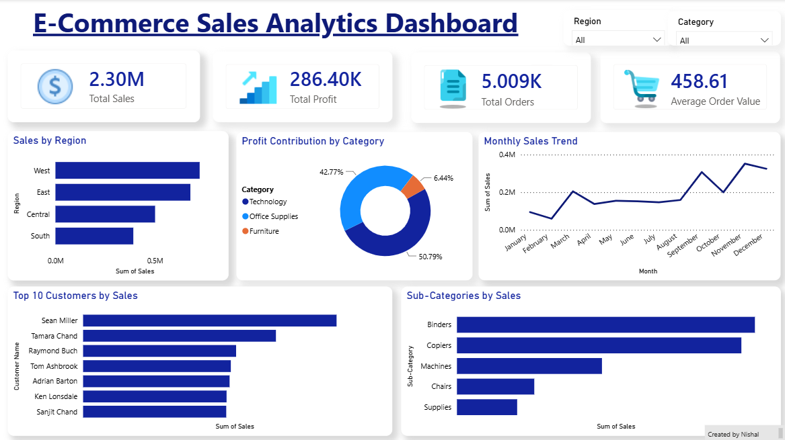

# E-Commerce Sales Analytics Dashboard

## Overview
Developed an interactive Power BI dashboard to analyze 2.3M+ sales, 286K+ profit, and 5K+ orders.

## Features
- KPI Cards (Sales, Profit, Orders, AOV)
- Sales Trend Analysis
- Regional Performance Analysis
- Profit Contribution by Category
- Top Customers Analysis
- Sub-Category Sales Analysis
- Interactive Region & Category Filters

## Tools Used
- Power BI
- DAX
- Data Modeling
- Data Visualization

## Key Insights
- West region generated the highest sales.
- Office Supplies contributed the highest profit share.
- November recorded the highest monthly sales.
- Sean Miller was the top revenue-generating customer.
